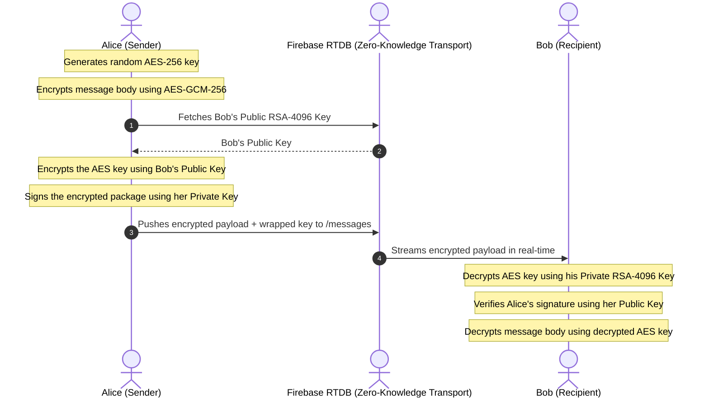

# 🛡️ Securem — E2E Encrypted Communication Platform

Securem is a state-of-the-art, secure-by-default messaging and communication platform designed to provide ultra-private, client-side encrypted interactions. Built using modern web technologies, it features real-time text chats, ephemeral media stories, immersive video reels, direct peer-to-peer file transfers, and end-to-end encrypted audio/video calling.

### 🔗 Live Stakeholder Demo:
👉 **[https://securem-six.vercel.app](https://securem-six.vercel.app)**

---

## 💎 Premium Technology Stack

- **Frontend Core:** React 19, TypeScript, Vite
- **Styling & Fluid Animations:** Vanilla CSS, Framer Motion (for premium glassmorphism layouts and seamless card transitions)
- **Database & Signaling:** Firebase Realtime Database (RTDB)
- **Security & Cryptography:** Web Crypto API (Native browser-level hardware-accelerated E2EE)
- **Real-Time Media:** WebRTC (Peer-to-Peer direct audio/video streaming)

---

## 🏗️ Architectural Core Features

### 1. 🔒 End-to-End Encrypted (E2EE) Messaging
Every single text, image, and file sent in Securem is encrypted on the sender's device and decrypted *only* on the recipient's device. No intermediary (including Firebase or servers) has access to the raw data.
*   **Key Exchange:** Uses **RSA-OAEP (4096-bit)** public/private key pairs generated locally on sign-up. Public keys are stored securely on Firebase to allow others to initiate handshakes, while Private keys are protected using a local master cryptographic password.
*   **Symmetric Encryption:** Text and media streams are encrypted using **AES-GCM (256-bit)** with uniquely generated Initialization Vectors (IV).
*   **Digital Signatures:** Uses **RSA-PSS** signatures to guarantee authenticity and prevent man-in-the-middle attacks.

#### Cryptographic Flow Diagram:


---

### 2. 📞 WebRTC Video & Audio Calling
Real-time, ultra-low-latency voice and video calls are established directly between peers.
*   **Zero-Server Signaling:** Firebase RTDB is utilized strictly as a secure WebRTC signaling broker (exchanging ICE Candidates, SDP Offers, and SDP Answers).
*   **P2P Connection:** Once the handshake is complete, media streams flow directly between the devices, ensuring zero latency, absolute privacy, and negligible server operational costs.

---

### 3. 🎬 Immersive Video Reels (TikTok-Style)
A premium vertical media player built to support high-performance vertical mobile-optimized video playback on both desktop and mobile screens.
*   **Premium Resizing Layout:** Videos are housed inside a centered 9:16 mobile container on desktop with a backing backdrop-blur filter to eliminate screen-stretching.
*   **Real-time Base64 to Blob conversion:** To operate fully "bucket-less", small video reels are stored as Base64 in RTDB and converted on-the-fly into memory-optimized browser `Blob` URLs, enabling hardware-accelerated rendering.
*   **Interactive Comments Sheet:** A gorgeous glassmorphism panel slides up to allow real-time database discussions while the video smoothly rescales to the top 35% of the screen.

---

### 4. ⏳ Ephemeral Media Stories
*   Users can share photos, short videos, links, or texts that auto-expire and are dynamically wiped after 24 hours.

---

## 🗄️ Database & Security Architecture
Securem operates on a **Zero-Knowledge** backend architecture. The database rules strictly enforce granular, authenticated-only path access.

```json
{
  "rules": {
    "users": {
      "$uid": {
        ".read": "auth != null",
        ".write": "auth != null && auth.uid == $uid"
      }
    },
    "chats": {
      "$chatId": {
        ".read": "auth != null",
        ".write": "auth != null"
      }
    },
    "messages": {
      "$chatId": {
        ".read": "auth != null",
        ".write": "auth != null"
      }
    },
    "user-chats": {
      "$uid": {
        ".read": "auth != null && auth.uid == $uid",
        ".write": "auth != null && auth.uid == $uid"
      }
    }
  }
}
```

---

## 📈 Stakeholder Business Value Proposition

1.  **Negligible Infrastructure Costs:** By offloading video calling to direct Peer-to-Peer streams (WebRTC) and utilizing client-side decryption, hosting, compute, and bandwidth overhead is virtually zero.
2.  **Uncompromising Security Compliance:** Perfect for privacy-focused organizations. Total protection against data leaks since database compromise yields only undecipherable encrypted ciphertexts.
3.  **Cross-Platform Adaptive UI:** Single codebase engineered to run flawlessly as a desktop dashboard and as a responsive mobile application.

---

## 🚀 Setting Up Locally

### 1. Clone the repository:
```bash
git clone https://github.com/minakshiramteke24-sudo/securem.git
cd securem
```

### 2. Install dependencies:
```bash
npm install
```

### 3. Start development server:
```bash
npm run dev
```

### 4. Build for production:
```bash
npm run build
```
